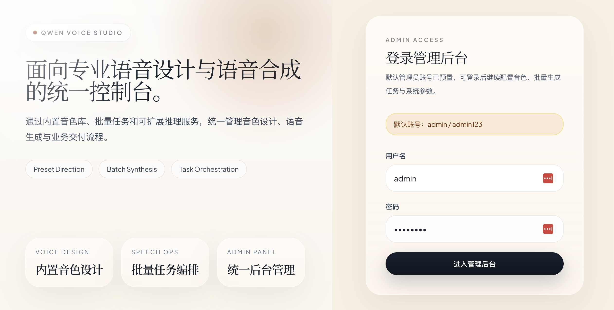
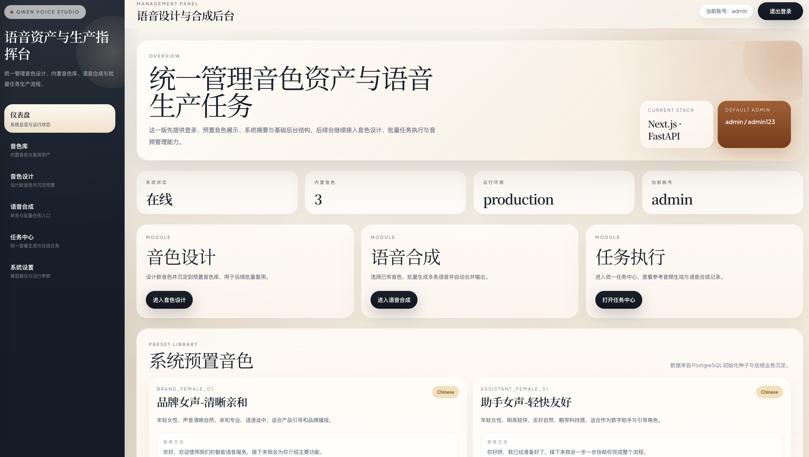
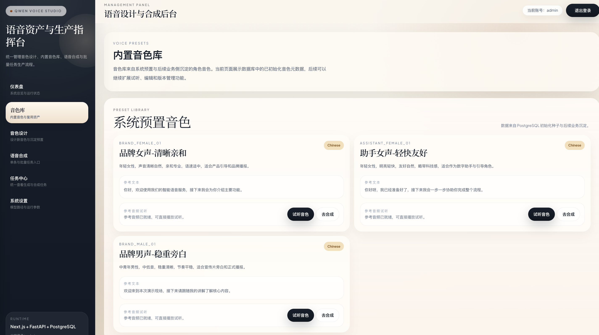
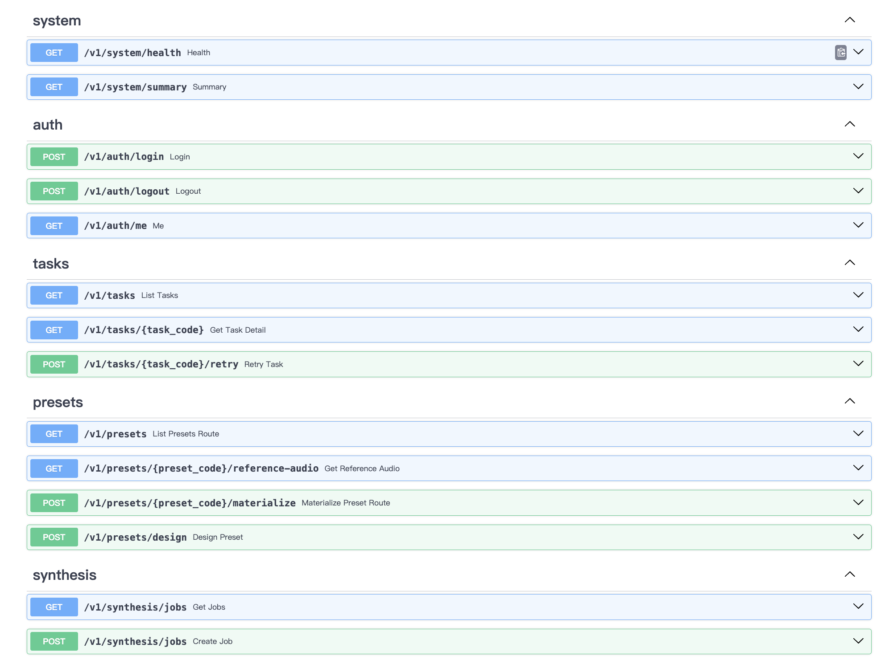

# Qwen Voice Studio

Qwen Voice Studio 是一个基于 Qwen3-TTS 的开源语音工作台，提供从音色设计、预置音色管理、参考音频生成到批量语音合成的一体化流程。

当前项目采用以下技术栈：

- 前端：Next.js 16 + React 19
- 后端：FastAPI + SQLAlchemy
- 数据库：PostgreSQL 16
- 推理：Qwen3-TTS VoiceDesign / Base
- 部署：Docker Compose

项目目标不是只提供单个脚本，而是把以下流程串成可用的管理台：

1. 用自然语言描述一个目标声音
2. 为该声音生成参考音频 `ref.wav`
3. 把它沉淀成可复用的 preset
4. 用该 preset 发起批量语音合成任务

## 功能概览

当前版本已经支持：

- 管理后台登录与会话控制
- 预置音色列表展示
- 对缺少参考音频的 preset 一键生成 `ref.wav`
- 参考音频生成状态持久化：`missing / generating / failed / ready`
- 参考音频试听
- 从音色库一键跳转到合成页
- 基于 preset 的批量语音合成
- 合成结果写入 `outputs/synthesis_jobs/<job_code>/`
- 项目内置 Swagger / ReDoc 接口文档
- Docker Compose 一键启动前后端和数据库

## 项目截图建议

如果你准备在 GitHub 上公开项目，建议后续补充这几类截图：

- 
- 
- 
- 
- 

## 仓库结构

```text
.
├── backend/                  FastAPI API、数据模型、推理服务
├── frontend/                 Next.js 管理台
├── configs/                  预置音色种子配置
├── examples/                 Python 脚本调用示例
├── models/                   本地模型目录（通过 compose 挂载）
├── assets/voice_presets/     预置音色资产目录（ref.wav / metadata.json）
├── outputs/                  合成结果输出目录
├── docker-compose.yml
└── Dockerfile
```

## 核心流程

### 1. 预置音色

项目启动后会从 `configs/voice_presets.array.example.json` 导入预置音色元数据。

这些预置项一开始可能只有：

- `name`
- `language`
- `ref_text`
- `instruct`

如果还没有参考音频，前端会显示 `生成参考音频` 按钮。点击后，后端会用 VoiceDesign 模型生成：

- `assets/voice_presets/<preset_code>/ref.wav`
- `assets/voice_presets/<preset_code>/ref.txt`
- `assets/voice_presets/<preset_code>/metadata.json`

### 2. 音色设计

你也可以在管理台中直接创建新的设计音色。创建成功后，系统会自动写入数据库和资产目录。

### 3. 批量合成

当 preset 拥有参考音频后，可以直接在合成页复用该声音，按多行文本批量生成结果。

## 快速开始

### 环境准备

推荐环境：

- Docker Desktop
- macOS / Linux
- 至少 16 GB 内存，越高越好
- 已准备本地 Qwen3-TTS 模型目录

### 本地模型准备

当前 `docker-compose.yml` 默认把 VoiceDesign 模型指向本地目录：

```text
/app/models/Qwen3-TTS-12Hz-1.7B-VoiceDesign
```

因此你需要提前把模型放到仓库的以下路径：

```text
models/Qwen3-TTS-12Hz-1.7B-VoiceDesign
```

当前仓库已经采用卷挂载方式：

```yaml
- ./models:/app/models
```

这意味着模型不会被打包进镜像，而是直接从本地目录挂载进容器。

### 启动服务

```bash
docker compose up --build
```

启动后访问：

```text
http://127.0.0.1:3000
```

接口文档入口：

```text
http://127.0.0.1:3000/api/docs
http://127.0.0.1:3000/api/redoc
http://127.0.0.1:3000/api/openapi.json
```

默认管理员账号：

- 用户名：`admin`
- 密码：`admin123`

## 使用说明

### 音色库

在音色库页中：

- `missing`：还没有参考音频，可以点击 `生成参考音频`
- `generating`：正在生成中，刷新页面后状态仍会保留
- `failed`：上次生成失败，可以重新发起
- `ready`：已可试听，可直接跳转到合成页

### 首次生成为什么比较慢

如果你是在 Docker CPU 环境下运行，首次生成参考音频通常需要 1 到 3 分钟，原因包括：

- 首次加载模型
- CPU 推理速度慢于 CUDA
- 音色设计本身比简单克隆更重

因此，“点击按钮后几秒内没有生成结果”并不一定是故障。

### 如何判断是否真的失败

可以看这几个信号：

- 页面状态是否从 `generating` 变成 `failed`
- 数据库中 `reference_audio_status` 是否为 `failed`
- `assets/voice_presets/<preset_code>/` 下是否生成了 `ref.wav`
- `docker compose logs app` 是否出现异常

## 接口文档

项目已经内置 FastAPI Swagger UI 和 ReDoc，并通过当前 Next.js 项目统一暴露，不需要额外记忆单独的后端端口。

- Swagger UI：`http://127.0.0.1:3000/api/docs`
- ReDoc：`http://127.0.0.1:3000/api/redoc`
- OpenAPI JSON：`http://127.0.0.1:3000/api/openapi.json`

文档已经适配当前项目的 `/api/backend/*` 代理路径，因此 Swagger 页面中的 `Try it out` 可以直接对现有接口发起请求。

## 接口响应规范

除音频文件流这类二进制响应外，项目内 JSON API 统一采用以下响应结构：

```json
{
	"code": 0,
	"message": "ok",
	"data": {}
}
```

约定如下：

- `code`：业务状态码，成功固定为 `0`，失败时通常与 HTTP 状态码一致
- `message`：面向前后端联调的统一消息文本
- `data`：实际业务数据；列表接口返回数组，详情接口返回对象

错误响应示例：

```json
{
	"code": 404,
	"message": "Preset not found",
	"data": null
}
```

这样可以保证：

- 前端请求层只需要做一次统一解包
- Swagger / ReDoc 中的接口契约更一致
- 后续接入更多页面、SDK 或第三方调用时更容易维护

## 关键目录

### 预置音色资产

```text
assets/voice_presets/<preset_code>/
```

生成后通常包含：

- `ref.wav`
- `ref.txt`
- `metadata.json`

### 合成输出

```text
outputs/synthesis_jobs/<job_code>/
```

通常包含：

- `line_01.wav`
- `line_02.wav`
- `...`
- `final.wav`（如果启用了合并）

## 本地开发

### 前端

```bash
cd frontend
npm install
npm run dev
```

### 后端

```bash
python3 -m venv .venv
source .venv/bin/activate
pip install -r backend/requirements.txt
uvicorn backend.app.main:app --reload --host 0.0.0.0 --port 8000
```

## 示例脚本

仓库内还保留了几个脚本示例，适合不通过管理台、直接用 Python 调试：

- `examples/voice_design_basic.py`
- `examples/voice_design_then_clone.py`
- `examples/reuse_designed_voice_batch.py`
- `examples/use_voice_preset_batch.py`
- `examples/build_voice_presets.py`

这些脚本适合做以下事情：

- 验证本地模型是否可用
- 快速对比提示词效果
- 先设计声音再复用合成
- 离线批量生成参考资产

## 配置项

后端主要配置项定义在 `backend/app/core/config.py`，常用项包括：

- `DATABASE_URL`
- `JWT_SECRET`
- `PRESET_SEED_FILE`
- `PRESET_LIBRARY_DIR`
- `SYNTHESIS_OUTPUT_DIR`
- `QWEN_TTS_MODEL`
- `QWEN_TTS_VOICE_DESIGN_MODEL`

当前 Docker Compose 中已经内置了一组默认值，开箱可跑。若要调整模型路径或数据库连接，可直接修改 `docker-compose.yml`。

## 已知限制

当前版本仍有这些边界：

- CPU 环境下速度较慢，不适合高并发
- 推理任务仍运行在 API 进程内，不是独立队列系统
- 生成状态已持久化，但还没有进度百分比
- 音色库当前偏向内部工作台，不是完整的素材管理平台
- `QWEN_TTS_MODEL` 默认仍可指向远程模型，若网络较差建议改为本地路径

## 路线图

建议后续迭代方向：

- 独立任务队列和 worker 进程
- 任务超时与中断恢复
- 预置音色搜索、筛选、标签化
- 音频波形、时长和试听体验增强
- 下载合成结果、打包导出
- 更完整的系统设置页
- OpenAPI 文档与 API 使用说明

## 常见问题

### 1. 点击“生成参考音频”后目录为空

优先检查：

- 模型是否使用本地路径而不是在线下载
- 容器内存是否足够
- 状态是否仍处于 `generating`
- `docker compose logs app` 是否出现 OOM 或模型加载错误

### 2. 为什么刷新后还显示“生成中”

这是预期行为。现在生成状态会写入数据库，刷新后前端会重新读取 `reference_audio_status`，并继续轮询直到任务完成或失败。

### 3. 为什么 Docker 构建会特别大

模型目录现在已经通过 `.dockerignore` 排除，不再打包进镜像。模型应该只通过卷挂载使用，而不是复制进镜像层。

## 开源说明建议

如果你准备把这个项目正式开源，建议补充以下内容：

- `LICENSE`
- GitHub Actions CI
- issue / PR 模板
- 贡献指南 `CONTRIBUTING.md`
- 更完整的英文 README 或中英双语 README

## 致谢

- Qwen 团队开源的 Qwen3-TTS
- FastAPI
- Next.js
- PostgreSQL